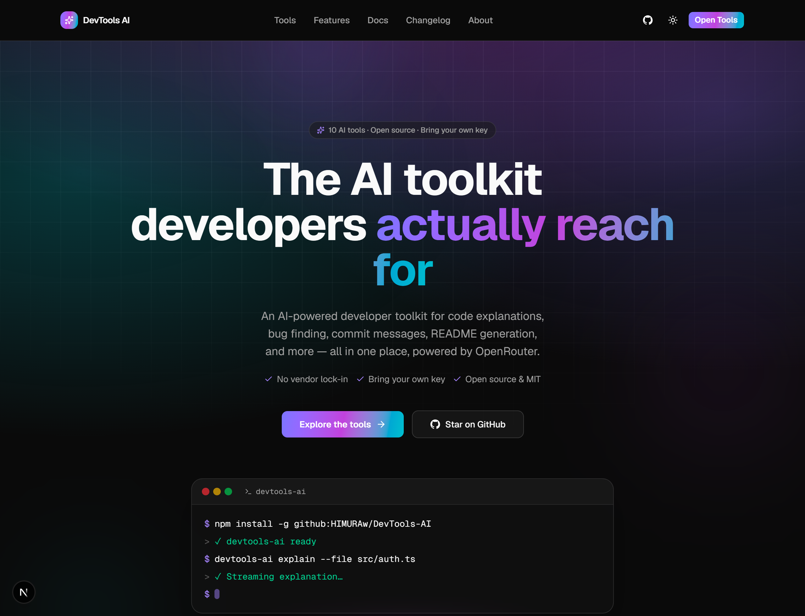
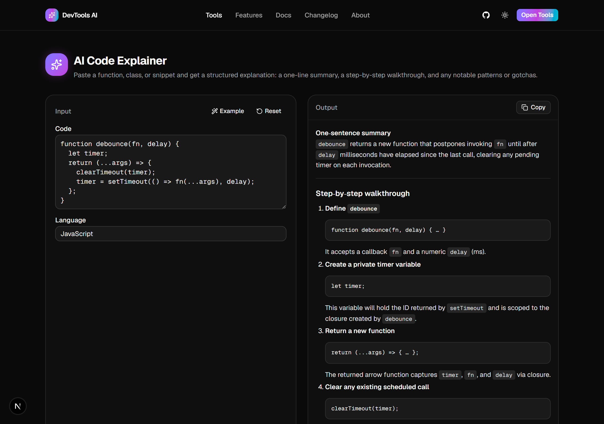
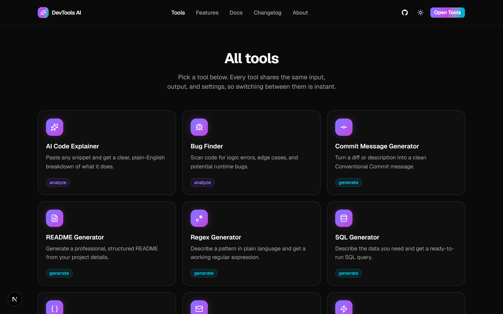
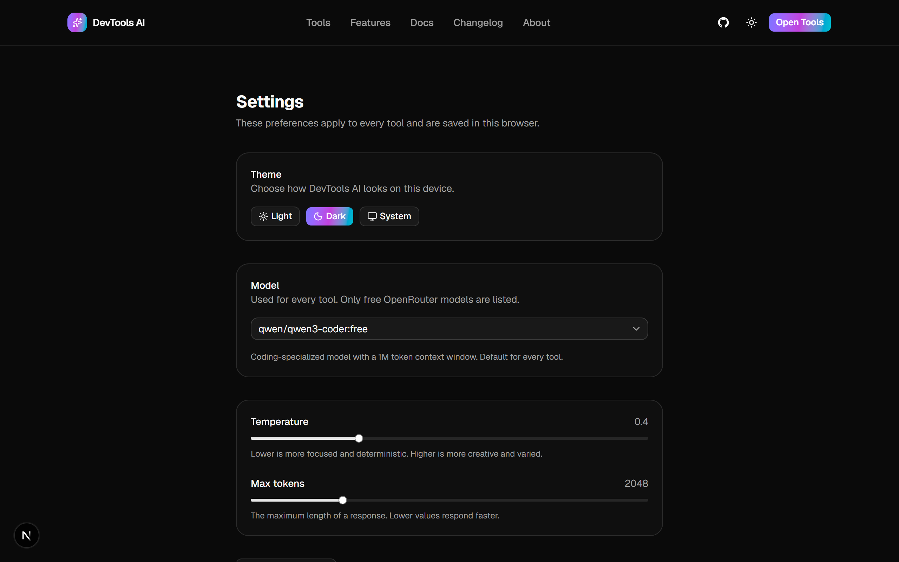

<div align="center">



<br />

# DevTools AI

**Ten single-purpose AI developer tools. One clean interface. Web app _and_ CLI.**

[](https://github.com/HIMURAw/DevTools-AI/actions/workflows/ci.yml)
[](https://www.npmjs.com/package/@himuraw/devtools-ai)
[](./LICENSE)
[](https://nextjs.org)
[](https://react.dev)
[](https://www.typescriptlang.org)
[](https://tailwindcss.com)
[](https://openrouter.ai)
[](./CONTRIBUTING.md)

[Live site](https://dev-tools-ai-gilt.vercel.app) · [Docs](https://dev-tools-ai-gilt.vercel.app/docs) · [CLI Reference](https://dev-tools-ai-gilt.vercel.app/docs/cli) · [Report a bug](https://github.com/HIMURAw/DevTools-AI/issues)

</div>

<br />

Most AI coding assistants live inside an editor or a chat window that doesn't fit every task. **DevTools AI is the opposite**: ten focused tools — explain, review, optimize, generate — each with exactly the input and output it needs, nothing else in the way. Bring your own [OpenRouter](https://openrouter.ai) key, no vendor lock-in, no account, no data stored.

Use it as a **web app**, or install the **exact same tools** as a `devtools-ai` command in your terminal — same prompts, same validation, same streaming, one shared service layer underneath.

## Why you might want this

- **10 tools, one interface** — code explainer, bug finder, commit message generator, README generator, regex/SQL/JSON→TS generators, email generator, code optimizer, code reviewer
- **Streams as it thinks** — in the browser and in the terminal, no spinner staring
- **Bring your own model** — a curated list of free OpenRouter models, switch anytime
- **Auto language detection** — paste code, the language field fills itself in
- **Also a real CLI** — `npm install -g` and pipe `git diff` straight into it
- **Nothing stored** — no accounts, no database; your key stays server-side, your prefs stay in your browser
- **Dark mode first**, built with shadcn/ui and a proper glassmorphism pass, not a default template

## See it in action

<table>
<tr>
<td width="50%">

**Explain any snippet, streamed live**


</td>
<td width="50%">

**Ten tools, one grid**


</td>
</tr>
</table>

<details>
<summary><b>Model, temperature, and theme — all in Settings</b></summary>
<br />

</details>

## Quick start

**Web app:**

```bash
git clone https://github.com/HIMURAw/DevTools-AI.git
cd DevTools-AI
pnpm install
cp .env.example .env.local        # add your OPENROUTER_API_KEY
pnpm dev                          # http://localhost:3000
```

**CLI** (no clone needed):

```bash
npm install -g @himuraw/devtools-ai
# or, without waiting on a published release:
npm install -g github:HIMURAw/DevTools-AI

devtools-ai explain --file src/index.ts
```

A key with zero credits works fine — the default model, `qwen/qwen3-coder:free`, is free. Full setup details: [Installation](https://devtools-ai.dev/docs/installation) · [CLI Reference](https://devtools-ai.dev/docs/cli).

## The ten tools

| Tool                     | What it does                                                 | CLI                    |
| ------------------------ | ------------------------------------------------------------ | ---------------------- |
| AI Code Explainer        | Plain-English breakdown of what a snippet does               | `devtools-ai explain`  |
| Bug Finder               | Flags logic errors and edge cases, with a fix for each       | `devtools-ai bugs`     |
| Commit Message Generator | Diff or description → Conventional Commit message            | `devtools-ai commit`   |
| README Generator         | Project details → a structured README.md                     | `devtools-ai readme`   |
| Regex Generator          | Plain language → a working, explained regular expression     | `devtools-ai regex`    |
| SQL Generator            | Plain language (+ optional schema) → a ready-to-run query    | `devtools-ai sql`      |
| JSON → TypeScript        | Raw JSON → precise, well-named interfaces                    | `devtools-ai json2ts`  |
| Email Generator          | Situation + tone → a ready-to-send email                     | `devtools-ai email`    |
| Code Optimizer           | Concrete, before/after performance & readability suggestions | `devtools-ai optimize` |
| Code Reviewer            | Structured review: correctness, style, security, priorities  | `devtools-ai review`   |

## How it's built

One tool registry (`config/tools.config.ts`) drives everything: the web form, the output renderer, the API route, and every CLI subcommand. Add an 11th tool by adding one entry — nothing else to wire up.

```
ToolShell (web)  ─┐
                   ├─▶ tool.schema.safeParse()  ─▶  services/ai-service.ts  ─▶  OpenRouter
src/cli (CLI)    ─┘         (same Zod schema)          (same service, no HTTP hop for the CLI)
```

- **Next.js 16** (App Router, Turbopack) · **React 19** · **TypeScript**, strict, no `any`
- **Tailwind CSS v4** + **shadcn/ui** (Base UI primitives) for the interface
- **Zustand** for persisted settings · **React Hook Form + Zod** for every form and API boundary
- **Framer Motion** for the marketing pages · **Commander** + **esbuild** for the CLI
- No database, no auth, no analytics — see [Privacy](https://devtools-ai.dev/privacy) for exactly what happens to your data

Full write-up: [Architecture](https://devtools-ai.dev/docs/architecture).

## Documentation

|                                                             |                                              |
| ----------------------------------------------------------- | -------------------------------------------- |
| [Getting Started](https://devtools-ai.dev/docs)             | What this is and how the pieces fit together |
| [Installation](https://devtools-ai.dev/docs/installation)   | Setup, scripts, adding a new tool            |
| [Configuration](https://devtools-ai.dev/docs/configuration) | Every environment variable                   |
| [CLI Reference](https://devtools-ai.dev/docs/cli)           | Every command, every flag, real examples     |
| [Architecture](https://devtools-ai.dev/docs/architecture)   | Request flow and design choices              |
| [API Reference](https://devtools-ai.dev/docs/api)           | The `/api/ai/[slug]` contract                |

## Environment variables

| Variable               | Required | Description                                                       |
| ---------------------- | -------- | ----------------------------------------------------------------- |
| `OPENROUTER_API_KEY`   | Yes      | Server-only. Never sent to the browser or exposed to CLI callers. |
| `NEXT_PUBLIC_SITE_URL` | No       | Used for metadata, OpenGraph tags, and the sitemap.               |

## Contributing

Issues and pull requests are genuinely welcome — small fixes, a new tool, a new OpenRouter model, docs corrections, all of it.

1. Fork and clone the repo, `pnpm install`
2. `pnpm dev` for the web app, `pnpm cli --help` for the CLI
3. `pnpm lint && pnpm typecheck && pnpm test` before opening a PR
4. Commits follow [Conventional Commits](https://www.conventionalcommits.org) (enforced by commitlint)

If you use this and like it, starring the repo helps other developers find it.

## License

[MIT](./LICENSE) © [HIMURA](https://github.com/HIMURAw)
